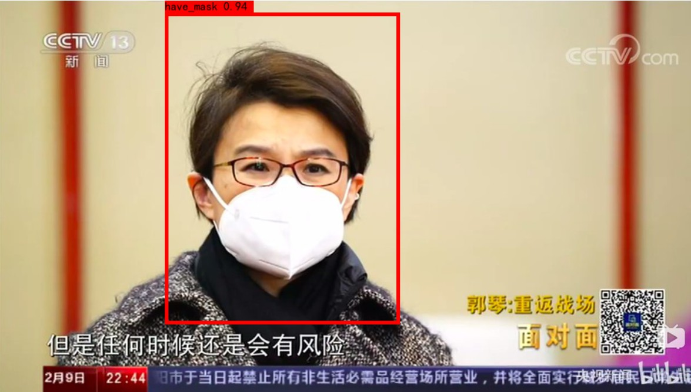

# yolo3-keras-breath_mask

基于YOLOV3的人体口罩佩戴检测

由于2020年新型冠状病毒，针对公共场合检测人员是否佩戴口罩，故用YOLOV3完成一个人体口罩佩戴检测。


## 效果展示




## 环境

`工欲善其事必先利其器`

- **Python：** 3.7.4
- **Tensorflow-GPU** 1.14.0
- **Keras:** 2.2.4

## 数据集


[口罩检测数据集]


##  训练

### 准备数据集

按照VOC数据集的格式来准备数据集，及图片以及xml标签

```sh
VOCdevkit
	-VOC2007
		├─ImageSets    # 存放数据集列表文件，由voc2yolo3.py文件生成
		├─Annotations  # 存放图片标签，xml 格式
		├─JPEGImages   # 存放数据集中图片文件
		└─voc2yolo3.py # 用来生成数据集列表文件
```

将你准备的数据集文件放入JPEGImages以及ImageSets文件中，然后运行`python voc2yolo3.py`来生成ImageSets中的数据列表文件


### 生成YOLOV3所需数据

在根目录下，运行 `python voc_annotation.py`，程序将在根目录下生成用于训练所需的数据列表，运行前记得修改voc_annotation.py中的classes

### YOLOv3训练

#### 训练步骤

 - 1.下载yolov3的权重文件[yolov3_weights](https://pjreddie.com/media/files/yolov3.weights)

 - 2.执行如下命令将darknet下的yolov3配置文件转换成keras适用的h5文件。

    `python convert.py yolov3.cfg yolov3.weights model_data/yolo.h5`

 - 3.在根目录下，运行 `train.py` 进行训练。可以根据情况修改 `train.py` 中的参数。


## 测试

  - 1.单张图片测试，需修改yolo.py文件中模型的位置，替换成你训练好的模型。然后在根目录下，运行`python predict_img.py`进行测试。

  - 2.自己电脑摄像头实时检测，在根目录下运行`python predict_video.py`


